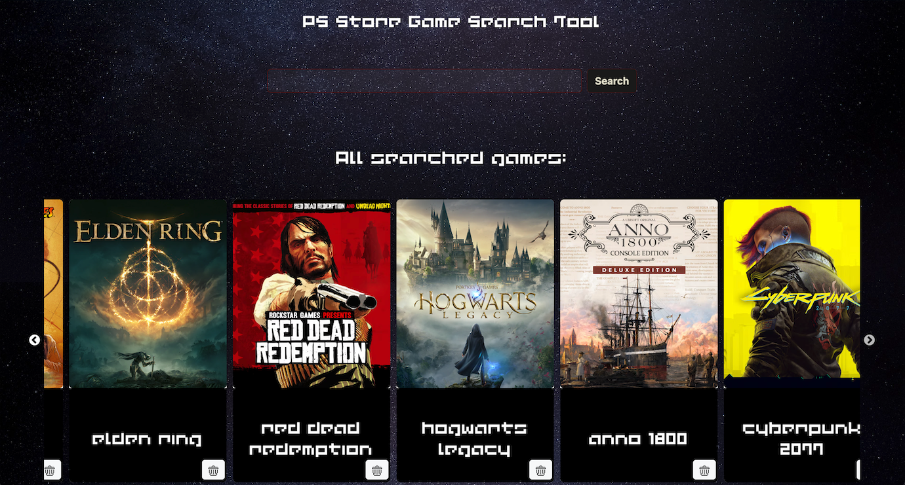
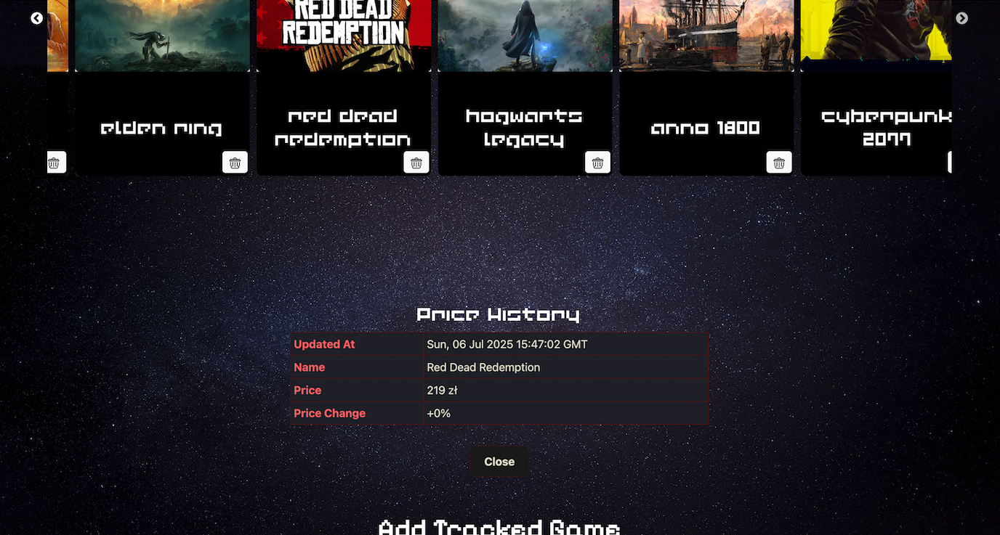
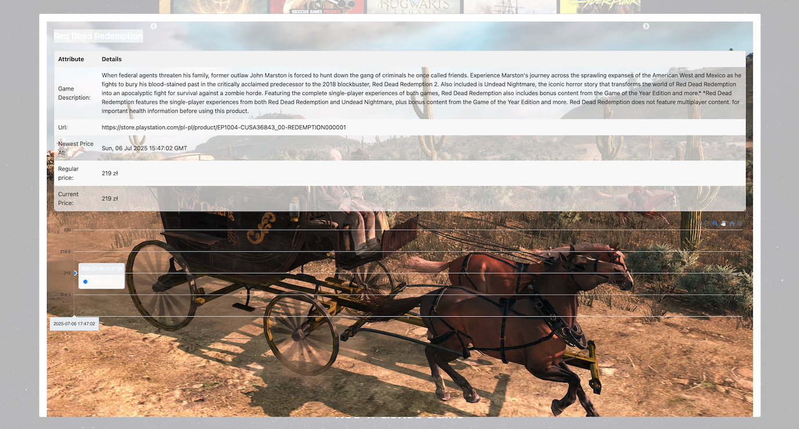
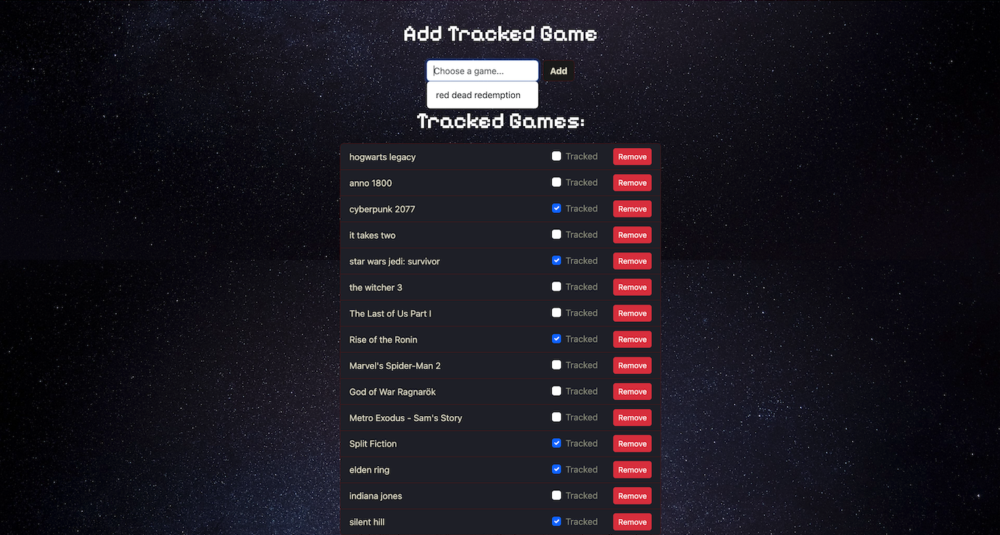

# Game Price Tracker 

A full-stack web application designed to track video game prices, maintain historical data, and send email notifications when prices drop.

## Tech Stack
- **Backend**: Flask, Flask-SQLAlchemy, Flask-Mail
- **Frontend**: React, Axios
- **Database**: SQLite
- **Automation**: Cron Job scheduled updates and email alerts (SMTP)

## Features
- **Search & Add**: Find games and add them to the local database for monitoring.
- **Price History**: Visualizes the change between regular and current prices over time.
- **Tracking Table**: A centralized dashboard to toggle tracking on/off or remove games.
- **Automated Alerts**: Compares the latest two price points and sends an email if a price drop is detected.
- **Game Info Page**: Detailed view including descriptions, screenshots, and current price status.

## Screenshots

### Game Search

*Interface for finding new games to track.*

### Game Info & History

*Detailed view of a game with its specific price history log.*

### Tracking Table

*Management dashboard for all monitored titles.*

## Installation

### 1. Backend Setup
Navigate to the root directory and install Python dependencies:

    pip install -r requirements.txt

### 2. Environment Variables
Create a .env file in the root directory to enable email notifications:

    MAIL_USERNAME=your-email@gmail.com
    MAIL_PASSWORD=your-app-specific-password

### 3. Frontend Setup
Navigate to your frontend folder and install dependencies:

    npm install

### 4. Run the Application
Start the Flask backend:

    python app.py

Start the React frontend:

    npm start
